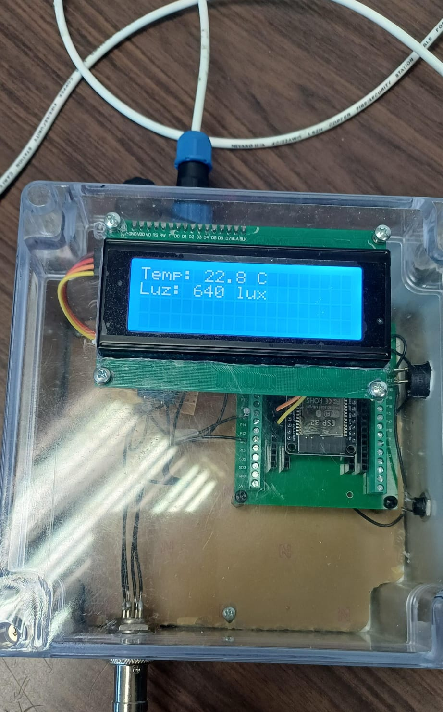
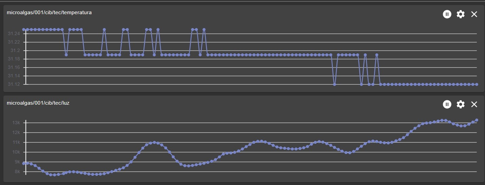
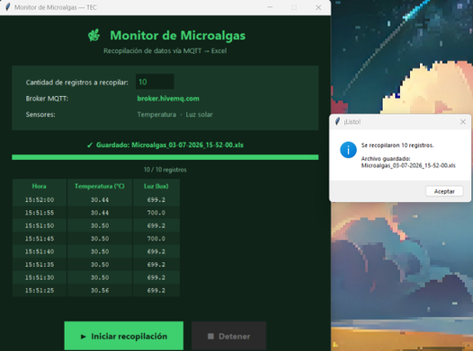
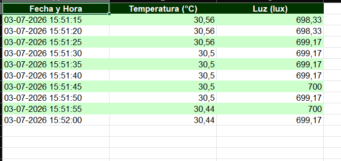

# Microalgae Monitoring System / Sistema de Monitoreo de Microalgas

> ESP32 · MQTT · BH1750 · DS18B20 · LCD · Python  
> Tecnológico de Costa Rica — Escuela de Ingeniería Electrónica

---

## English

Real-time environmental monitoring system for a microalgae pond. Reads temperature (DS18B20) and light intensity (BH1750), publishes data over MQTT, and displays live readings on a local LCD screen. A companion Windows app allows data collection and export to Excel without any technical setup.


-->Image pending

---

### 1. Firmware — `main.cpp` and PlatformIO

#### General flow

```
ESP32 boots
    │
    ├── Initialize LCD → show startup messages
    ├── Initialize BH1750 (I2C, GPIO 21/22)
    ├── Initialize DS18B20 (1-Wire, GPIO 4)
    ├── Connect to WiFi
    └── Connect to MQTT broker (broker.hivemq.com)
            │
            └── Every 5 seconds:
                    ├── Read temperature (DS18B20)
                    ├── Read light level (BH1750)
                    ├── Update LCD display
                    └── Publish to MQTT topics
```

The system runs without blocking delays — all timing is handled with `millis()`. If WiFi or MQTT drops, reconnection is attempted automatically. After 5 consecutive MQTT failures the ESP32 restarts itself. All sensor errors and connection states are shown on the LCD in real time.

#### MQTT topics

| Topic | Data |
|-------|------|
| `microalgas/001/cib/tec/temperatura` | Temperature in °C |
| `microalgas/001/cib/tec/luz` | Light in lux |
| `microalgas/001/cib/tec/estado` | `online` / `offline` (Last Will) |

#### Upload firmware (PlatformIO)

1. Install [VS Code](https://code.visualstudio.com/) and the [PlatformIO extension](https://platformio.org/install/ide?install=vscode)
2. Clone this repository and open the `firmware/` folder in VS Code
3. Copy `config.example.h` → `config.h` and fill in your WiFi credentials:

```cpp
// config.h — never commit this file
#define WIFI_SSID     "your_network_name"
#define WIFI_PASSWORD "your_password"
```

> `config.h` is listed in `.gitignore` and will never be uploaded to GitHub. Never paste credentials directly in `main.cpp`.

4. Connect the ESP32 via USB
5. Click **Upload** (→) in the PlatformIO toolbar — all libraries install automatically

#### PlatformIO dependencies

```ini
lib_deps =
    milesburton/DallasTemperature@^3.11.0
    paulstoffregen/OneWire@^2.3.7
    claws/BH1750@^1.3.0
    marcoschwartz/LiquidCrystal_I2C@^1.1.4
    knolleary/PubSubClient@^2.8
```

---

### 2. Usage guide — `docs/INSTRUCCIONES_DE_USO.pdf`

The full usage guide covers system installation, real-time data visualization, and data collection to Excel. Below is a summary.

#### 2.1 Hardware installation

Connect 3 cables to the main enclosure:

1. **Power cable** — plug into the small black connector (DC barrel jack)
2. **Light sensor cable** — plug into the silver connector (GX16, twist to lock)
3. **Temperature sensor cable** — plug into the large black connector (GX16, twist to lock)

Once all cables are connected, turn the system on using the switch next to the power cable. The LCD will show the startup sequence and then display live temperature and light readings. If any sensor or connection fails, the LCD shows an error message — turn the switch off and on to restart.



#### 2.2 Real-time data visualization (MQTT Explorer)

1. Download and install [MQTT Explorer](https://mqtt-explorer.com/)
2. Create a new connection: set **Host** to `broker.hivemq.com`, port `1883`, no username or password
3. Click **Advanced** and delete the default topics (`#` and `$SYS/#`)
4. Add the following topics using the **+ADD** button:
   - `microalgas/001/cib/tec/temperatura`
   - `microalgas/001/cib/tec/luz`
5. Click **Back** then **Connect**
6. Once connected, expand the topic tree on the left to see live values
7. To view a chart, double-click a value and click **Add to chart panel** — both sensors can be charted simultaneously



#### 2.3 Data collection to Excel (Monitor_Microalgas.exe)

1. Make sure the ESP32 is powered on and all cables are connected
2. Open `Monitor_Microalgas.exe`
3. Set the number of records to collect (each record = one temperature + light measurement pair)
4. Click **Iniciar recopilación**
5. Data appears in the table in real time as it arrives
6. When the target count is reached, an Excel file is saved automatically:

```
Microalgas_DD-MM-YYYY_HH-MM-SS.xls
```

> If a red permission error appears, move the `.exe` to your Desktop or Documents folder and try again.




---

## Español

Sistema de monitoreo ambiental en tiempo real para un estanque de microalgas. Lee temperatura (DS18B20) e intensidad lumínica (BH1750), publica los datos vía MQTT y muestra las lecturas en pantalla LCD local. Una aplicación Windows permite recopilar y exportar datos a Excel sin configuración técnica.


-->Imagen pendiente

---

### 1. Firmware — `main.cpp` y PlatformIO

#### Flujo general

```
ESP32 enciende
    │
    ├── Inicializa LCD → muestra mensajes de arranque
    ├── Inicializa BH1750 (I2C, GPIO 21/22)
    ├── Inicializa DS18B20 (1-Wire, GPIO 4)
    ├── Conecta a WiFi
    └── Conecta al broker MQTT (broker.hivemq.com)
            │
            └── Cada 5 segundos:
                    ├── Lee temperatura (DS18B20)
                    ├── Lee intensidad de luz (BH1750)
                    ├── Actualiza la pantalla LCD
                    └── Publica a los topics MQTT
```

El sistema corre sin delays bloqueantes — toda la temporización se maneja con `millis()`. Si WiFi o MQTT se cae, la reconexión se intenta automáticamente. Tras 5 fallos consecutivos de MQTT, el ESP32 se reinicia solo. Todos los errores de sensores y estados de conexión se muestran en la LCD en tiempo real.

#### Topics MQTT

| Topic | Dato |
|-------|------|
| `microalgas/001/cib/tec/temperatura` | Temperatura en °C |
| `microalgas/001/cib/tec/luz` | Luz en lux |
| `microalgas/001/cib/tec/estado` | `online` / `offline` (Last Will) |

#### Subir el firmware (PlatformIO)

1. Instalar [VS Code](https://code.visualstudio.com/) y la [extensión PlatformIO](https://platformio.org/install/ide?install=vscode)
2. Clonar este repositorio y abrir la carpeta `firmware/` en VS Code
3. Copiar `config.example.h` → `config.h` y completar con las credenciales WiFi:

```cpp
// config.h — nunca subir este archivo a GitHub
#define WIFI_SSID     "nombre_de_tu_red"
#define WIFI_PASSWORD "tu_contraseña"
```

> `config.h` está en `.gitignore` y nunca se subirá a GitHub. No pegar credenciales directamente en `main.cpp`.

4. Conectar el ESP32 por USB
5. Click en **Upload** (→) en la barra de PlatformIO — las librerías se instalan automáticamente

#### Dependencias PlatformIO

```ini
lib_deps =
    milesburton/DallasTemperature@^3.11.0
    paulstoffregen/OneWire@^2.3.7
    claws/BH1750@^1.3.0
    marcoschwartz/LiquidCrystal_I2C@^1.1.4
    knolleary/PubSubClient@^2.8
```

---

### 2. Manual de uso — `docs/INSTRUCCIONES_DE_USO.pdf`

El manual completo cubre la instalación del sistema, la visualización de datos en tiempo real y la recopilación de datos a Excel. A continuación se resume cada sección.

#### 2.1 Instrucciones de montaje

Conectar 3 cables a la caja principal:

1. **Cable de alimentación** — va al conector pequeño de color negro (barrel jack DC)
2. **Cable del sensor de luz** — va al puerto de color plateado (conector GX16, darle vueltas a la rosca para fijar)
3. **Cable del sensor de temperatura** — va al puerto negro más grande (conector GX16, darle vueltas a la rosca para fijar)

Con todos los cables conectados, encender el sistema con el switch al lado del cable de alimentación. La LCD mostrará la secuencia de arranque y luego las lecturas en tiempo real. Si existe algún error, la pantalla lo indicará — apagar y encender el switch para reiniciar.


#### 2.2 Observación de datos en tiempo real (MQTT Explorer)

1. Descargar e instalar [MQTT Explorer](https://mqtt-explorer.com/)
2. Crear una conexión nueva: en **Host** colocar `broker.hivemq.com`, puerto `1883`, sin usuario ni contraseña
3. Click en **Advanced** y borrar los topics por defecto (`#` y `$SYS/#`)
4. Agregar los siguientes topics con el botón **+ADD**:
   - `microalgas/001/cib/tec/temperatura`
   - `microalgas/001/cib/tec/luz`
5. Click en **Back** y luego en **Connect**
6. Una vez conectado, expandir el árbol de topics en la izquierda para ver los valores en tiempo real
7. Para ver una gráfica, hacer doble click en un valor y presionar **Add to chart panel** — se pueden graficar ambos sensores simultáneamente


#### 2.3 Recopilación y almacenamiento de datos a Excel (Monitor_Microalgas.exe)

1. Asegurarse de que el ESP32 esté encendido y todos los cables conectados
2. Abrir `Monitor_Microalgas.exe`
3. Elegir la cantidad de registros a recopilar (cada registro = un par de mediciones de temperatura y luz)
4. Click en **Iniciar recopilación**
5. Los datos aparecen en la tabla en tiempo real a medida que llegan
6. Al completar, se guarda automáticamente un archivo Excel:

```
Microalgas_DD-MM-YYYY_HH-MM-SS.xls
```

> Si aparece un error de permisos en rojo, mover el `.exe` al Escritorio o a la carpeta Documentos e intentar de nuevo.


---

## Repository structure / Estructura del repositorio

```
microalgas-monitor/
├── firmware/
│   ├── src/main.cpp
│   ├── config.example.h
│   ├── config.h              ← not tracked / no rastreado
│   └── platformio.ini
├── desktop_app/
│   └── app.py
├── docs/
│   ├── img/
│   │   ├── sistema_estanque.jpg
│   │   ├── gabinete_conectores.jpg
│   │   ├── mqtt_explorer.png
│   │   └── app_monitor.png
│   └── INSTRUCCIONES_DE_USO.pdf
├── .gitignore
└── README.md
```

## License / Licencia

MIT — Tecnológico de Costa Rica

---

## Credits / Créditos

The MQTT-to-Excel data collection logic (`MQTT2Excel.py`) is based on the work of **[@gsampallo](https://github.com/gsampallo)**:

> [gsampallo/mqtt2excel](https://github.com/gsampallo/mqtt2excel) — Original implementation for collecting MQTT data into Excel using Python.

The desktop application (`Monitor_Microalgas.exe`) extends this base with a graphical interface, real-time data table, progress tracking, and automatic file naming.

---

La lógica de recopilación de datos MQTT a Excel (`MQTT2Excel.py`) está basada en el trabajo de **[@gsampallo](https://github.com/gsampallo)**:

> [gsampallo/mqtt2excel](https://github.com/gsampallo/mqtt2excel) — Implementación original para recopilar datos MQTT en Excel usando Python.

La aplicación de escritorio (`Monitor_Microalgas.exe`) extiende esta base agregando interfaz gráfica, tabla de datos en tiempo real, barra de progreso y nombre de archivo automático.
